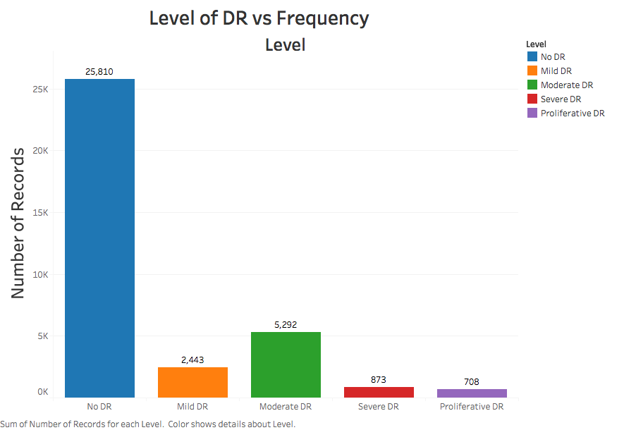
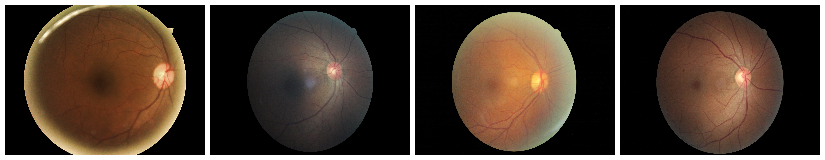

# DRClassifier

## Classifying Diabetic Retinopathy With Convolutional Neural Networks

## Introduction and Objective

Diabetic retinopathy is the leading cause of blindness among the working-age population in developed countries, affecting over 93 million individuals. The urgent need for a comprehensive and automated screening method for diabetic retinopathy has been recognized, and advancements in image classification, pattern recognition, and machine learning have made significant progress in this area. The goal of this capstone project is to develop a new model that demonstrates realistic clinical potential, utilizing eye images as input.

This project is driven by two key motivations:

* Personal Interest: Image classification has captivated me for years, particularly in the context of large-scale datasets.

* Efficiency: Delays between patient eye scans, analysis by medical professionals, and follow up appointments can be detrimental. By processing images in real time, DRClassifier aims to enable immediate scheduling for necessary treatments.

## Table of Contents
1. [Data](#data)
2. [Exploratory Data Analysis](#exploratory-data-analysis)
3. [Preprocessing](#preprocessing)
    * [Download Images to EC2](#download-all-images-to-ec2)
    * [Crop & Resize Images](#crop-and-resize-all-images)
    * [Rotate and Mirror All Images](#rotate-and-mirror-all-images)
4. [CNN Architecture](#neural-network-architecture)
5. [Results](#results)
6. [Next Steps](#next-steps)
7. [References](#references)

## Data

The data originates from a [2015 Kaggle competition](https://www.kaggle.com/c/diabetic-retinopathy-detection). but it deviates from typical Kaggle datasets. Unlike most competitions where the data is pre-processed, this dataset requires significant cleaning and organization.

All images are sourced from various individuals, captured with different cameras, and vary in size. As detailed in the [preprocessing](#preprocessing) section, this dataset is notably noisy, necessitating multiple preprocessing steps to standardize the images for effective model training.

The training dataset comprises 35,126 images, which undergo augmentation during preprocessing.

## Exploratory Data Analysis

The initial analysis focused on the training labels. Despite five categories to predict, the plot below reveals a severe class imbalance in the original dataset.

Of the original training data, 25,810 images are classified as not having retinopathy,
while 9,316 are classified as having retinopathy.

To address the class imbalance, specific steps were implemented during the [preprocessing](#preprocessing) phase. Additionally, the variance among images is significant, as illustrated by the examples of class 0 (no retinopathy) and class 4 (proliferative retinopathy) below.

  

## Preprocessing

The preprocessing pipeline is the following:

1. Download all images to EC2 using the [download script](src/download_data.sh).
2. Crop & resize all images using the [resizing script](src/resize_images.py) and the [preprocessing script](src/preprocess_images.py).
3. Rotate & mirror all images using the [rotation script](src/rotate_images.py).
4. Convert all images to array of NumPy arrays, using the [conversion script](src/image_to_array.py).

### Download All Images to EC2
The images were downloaded using the Kaggle CLI. Running this on an EC2 instance
allows you to download the images in about 30 minutes. All images are then placed
in their respective folders, and expanded from their compressed files. In total,
the original dataset totals 35 gigabytes.

### Crop and Resize All Images
All images were resized to 256 by 256 pixels. Although this increases training time, it enhances the detail retained in the images compared to a smaller size of 128 by 128 pixels.

Furthermore, 403 images were removed from the training set due to warnings raised by Scikit-Image during resizing, indicating that these images lacked color information. Consequently, any completely black images were excluded from the training data.

### Rotate and Mirror All Images
All images were both rotated and mirrored. Images without retinopathy were mirrored, while those with retinopathy underwent mirroring and were rotated at 90, 120, 180, and 270 degrees.

The first images illustrate pairs of eyes with black borders. Notably, cropping and rotations effectively eliminate most of the noise.

After applying rotations and mirroring, the class imbalance was addressed, resulting in several thousand additional images with retinopathy. In total, 106,386 images were prepared for processing by the neural network.

## Neural Network Architecture

The model is built using PyTorch. PyTorch was chosen for its dynamic computation graph, which allows for greater flexibility during model development and debugging.

For predicting two categories, DRClassifier utilizes three convolutional layers, each having a depth of 32. A Max Pooling layer is applied after all three convolutional layers with size (2,2).

After pooling, the data is fed through a single dense layer of size 128, and finally to the output layer, consisting of 2 softmax nodes.

## Results
The DR classifier was created to determine if a patient has retinopathy. The current model returns the following scores.

| Metric | Value |
| :-----: | :-----: |
| Accuracy (Train) | 82% |
| Accuracy (Test) | 80% |
| Precision | 88% |
| Recall | 77% |

What accounts for this performance? Aside from addressing the class imbalance, the cropping technique enhances the model's efficacy by eliminating extra black areas in the images, allowing the network to focus solely on the eye.

## Next Steps
1. Model Retraining: Implement a mechanism to retrain the neural network with new photos. This is a common practice that optimizes model performance. Measures will be established to validate images before they are added to the classifier, ensuring that low-quality images do not adversely affect its accuracy.

2. Model Deployment: Convert the PyTorch model to CoreML for deployment in a DRClassifier iOS application. CoreML, a framework developed by Apple, facilitates the integration of machine learning into iOS devices. This conversion allows Python developers to export their models as .mlmodel files and seamlessly incorporate them into the iOS development process.

The model's ability to perform classification locally means that an internet connection is unnecessary, enhancing the practicality of using DRClassifier in remote areas.

## References

1. [What is Diabetic Retinopathy?](http://www.mayoclinic.org/diseases-conditions/diabetic-retinopathy/basics/definition/con-20023311)

2. [Diabetic Retinopathy Winners' Interview: 4th place, Julian & Daniel](http://blog.kaggle.com/2015/08/14/diabetic-retinopathy-winners-interview-4th-place-julian-daniel/)

## Tech Stack

